# Coder Academy - T3A2-A - Full Stack App (Part A)

## R1 - Description of your website

- Purpose
- Functionality / features
- Target audience
- Tech stack

### PURPOSE

Our client, the Brisbane Coffee Society (BCS) has requested for us to build a website to connect coffee drinkers with cafes for fast coffee ordering and pickup.

According to the client:

"Sometimes, getting your desired coffee when you need it can be very difficult. Queues to order and waiting while coffee is made takes up precious time, and the endless food and menu option trawling options of existing sites/apps takes too long. We want a simple site that enables us to order and pickup our favourite coffee quickly from nearby cafes."

The "Coffiends" website will address this gap in the market. It will target coffee serving cafes and coffee drinking customers. Cafes will be signed up (by BCS) and provide their coffee menu and prices. Customers will be able to buy coffees based on their preferred coffee type. Coffee orders are sent through to the cafe for fulfilment and customers can pick them up at a time of their choosing in the next 30 mins. The website is intended to provide a very quick and simple coffee ordering process for customers and additional business for cafes.

### FUNCTIONALITY / FEATURES

Core features:

- Cafe search map using geolocation
- Ordering
- Cafe/menu/coffee CRUD & filtering
- User management
- Email notifications
- Purchasing

Desirable:

- user ratings
- more than just one coffee purchasing
- loyalty program

#### User Management & Authentication/Authorization

The website will have a user management system for signup/login/logout. There will be three distinct roles - users, cafes and admins. User authentication and authorization will be used for security and role-based site access restrictions, making sure users are who they purport themselves to be, and cafes can only access their own details while admins can access all cafes.

#### Cafe/Menu/Coffee CRUD Management

Cafes will need to be setup in order to sell coffee through the site. A cafe will be added to the website by an administrator. Admins will then provide sign-in details to cafes so they can access the dashboard, setup their menu and view orders. The list of all cafes can be seen by admins, who can filter the list by cafe name, and they have access to edit cafe details or delete cafes.

Cafes will be able to create and edit their menus by selecting a coffee type and setting its price. Menus consist of coffee types and prices. Coffees can be added to or deleted from menus.

Site coffee types are controlled by administrators. They can view, create and delete the coffee types used on the site.

#### Cafe Map & Ordering

On loading the website, customers will be asked to select the type of coffee they are looking for. The coffee they select and their geolocation coordinates are used to populate of their location with cafes that offer that coffee type who have signed up to the app. Customers can check the prices of each cafe marked on the map, and decide how far they are willing to walk to pick up their coffee or how much they are willing to pay. Once they have decided, they will select the cafe they want to order from and be asked for their coffee specifics (milk/sugar/size). From there they enter, their name and email/phone and are redirected for payment.

#### Payment

Payment for the coffee is handled by a third party to remove the website from being in scope for PCI compliance. Customers will be directed to a Stripe page connected to the cafes account that will process the payment using credit card details.

#### Notifications

Email notifications will be sent to customers to confirm payment was successful and the order was received by the cafe. Cafes will receive emails when a new order comes in.

#### Order Management/Cafe Dashboard

Cafes will have a dashboard when they login showing active orders and a link to view recent orders. Active orders will consist the coffee type & specifics, the order name and phone, the time it is to be ready by and have a check box/button to be used when the order is complete. When new orders come in, cafes get a notification email, and a sound/alert pops up on the site as well.

### TARGET AUDIENCE

The website is targeted at people who drink coffee. In particular, it's targeted at people who know what coffee they want, and want to get it without fuss or queues. The time-poor and caffeine-desperate.

The site is also targeted at cafes as it provides another path to business.

### TECH STACK

- React
- Express
- Node
- MongoDB
- HTML
- CSS
- Git
- Heroku

---

## R2 - Dataflow Diagram

### Home

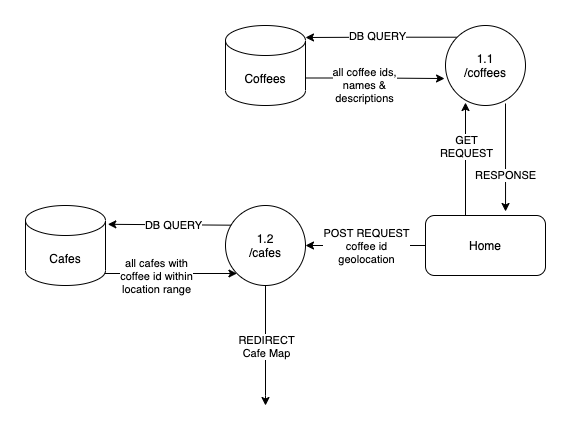

### Login

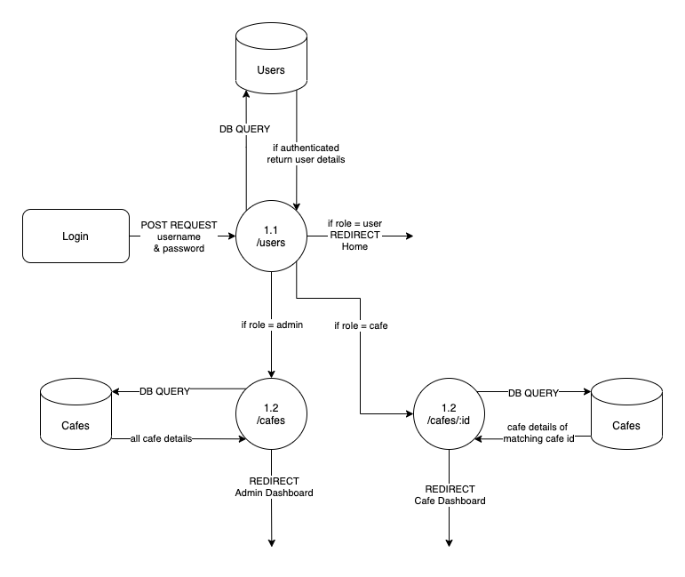

### Cafe Map & Ordering

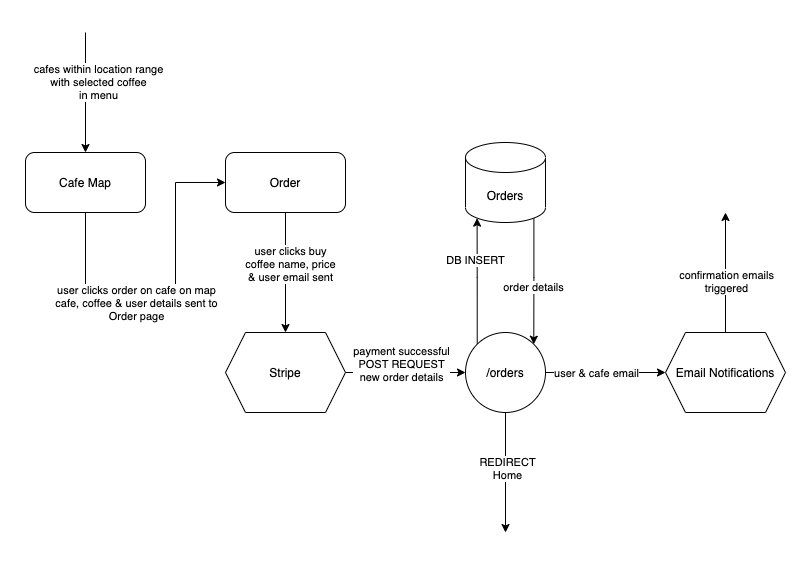

### User Registration

### Edit User

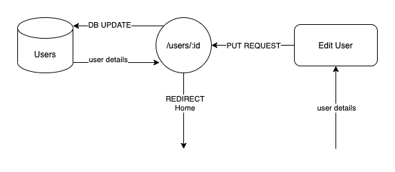

### Cafe Dashboard

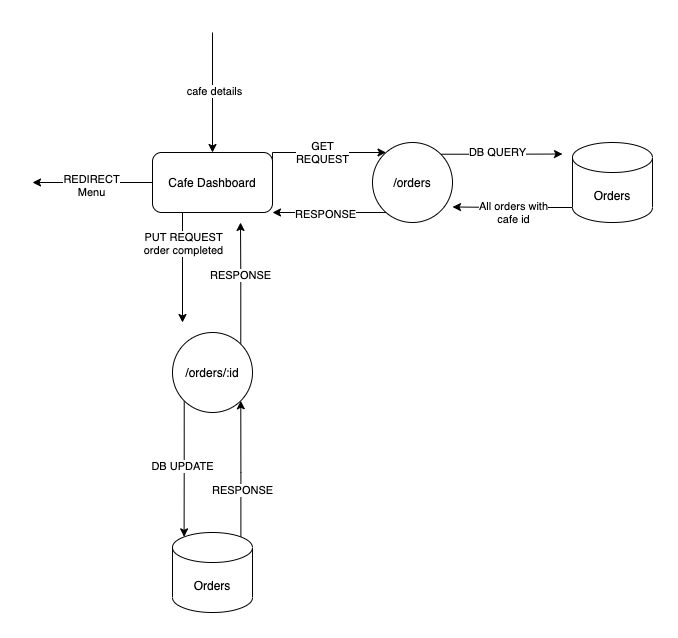

### Add/Edit Menu

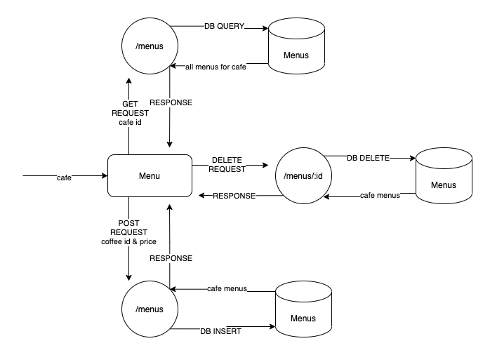

### Admin Dahsboard

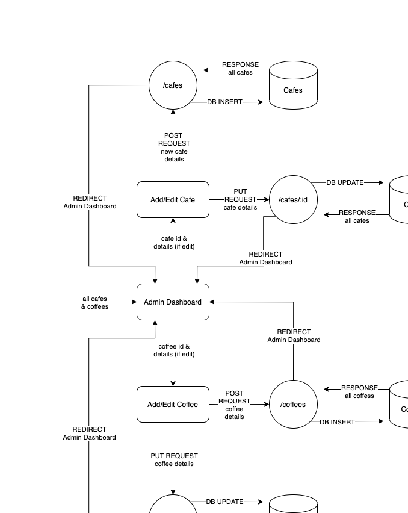

---

## R3 - Application Architecture Diagram

---

## R4 - User Stories

**_Coffee Lover/Guest_**

1. As a coffee lover, I want to be able to choose a coffee, so that I can only see prices for the coffee I want.
2. As a coffee lover, I want to be able to search/filter all available coffees, so I don’t spend too long going through all available coffees.
3. As a coffee lover, I want to be able to only see cafes in my specified area, so that I don’t have to look through irrelevant data.
4. As a coffee lover, I want to easily navigate through the app, so that it doesn’t confuse and frustrate me.
5. As a coffee lover, I want to be able to specify the pick up time, so that I don’t have to wait for it to be ready.
6. As a coffee lover, I want my details to be handled securely, so that I don’t have to worry about the privacy of my information.
7. As a coffee lover, I want to receive a confirmation of order, so that I know my purchase was successful.
8. As a coffee lover, I want to be able to log in. to be able to save my contact details and preferences. (Added as per Client wishes 22/01/21)
9. As a coffee lover, I would like the app to be able to pick up my location, so that I could narrow down my search area. (Added as per Client wishes 22/01/21)

**_Cafe Owner_**

1. As a cafe owner, I want to be able to log into my account, to be able to see all current orders.
2. As a cafe owner, I want to be able see previous orders, so that I can respond to any customer enquiries.
3. As a cafe owner, I want to be able to mark coffee orders as done, so I can clear the current orders table.
4. As a cafe owner, I want to be able to update my menu, so I can change it when necessary.

**_Admin_**

1. As admin, I want to be able to log into my account, to be able to update the information on the page.
2. As admin, I want to be able to see, search, delete and edit cafes, so that I can make changes as necessary to the list of subscribed cafes.
3. As admin, I want to be able to see, search, delete and edit coffees, so that I can update the available coffees list as necessary.
4. As admin, I want to be able to add new cafes, so that we can sign up new ones.
5. As admin, I want to be able to add new coffees, to keep the coffee list up to date.

**_Additional nice-to-have user stories_**

- As a coffee lover, I would like to be rewarded for using the app, to motivate me to keep using the app in the future.
- As a coffee lover, I would like to see Google ratings for the cafes, to be able to make a choice between cafes more easily.
- As a coffee lover, I would like to order more than one coffee, so that I can some for my friends/colleagues.
- as a cafe owner, I would like the app to make a sound, every time an order comes through to my dashboard.

---

## R5 - Wireframes

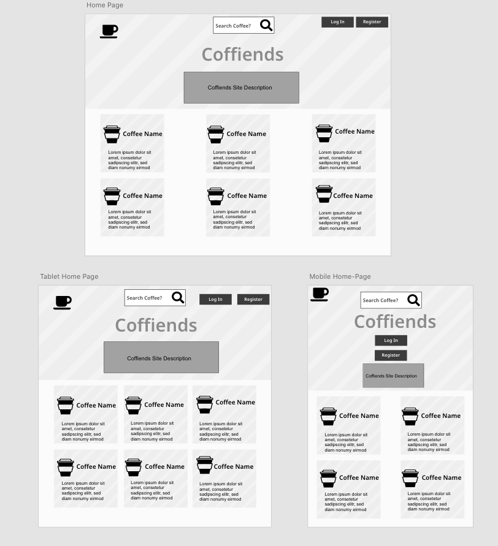

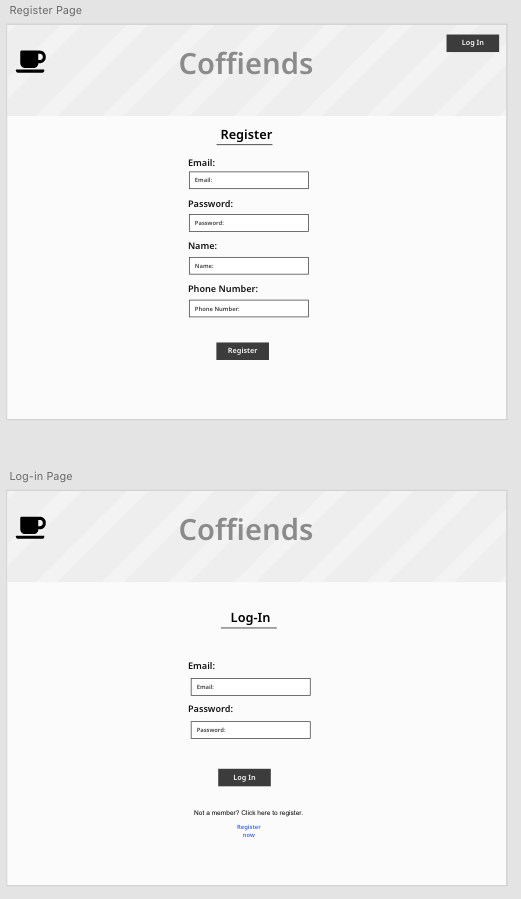

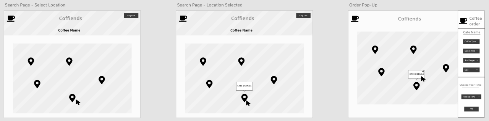

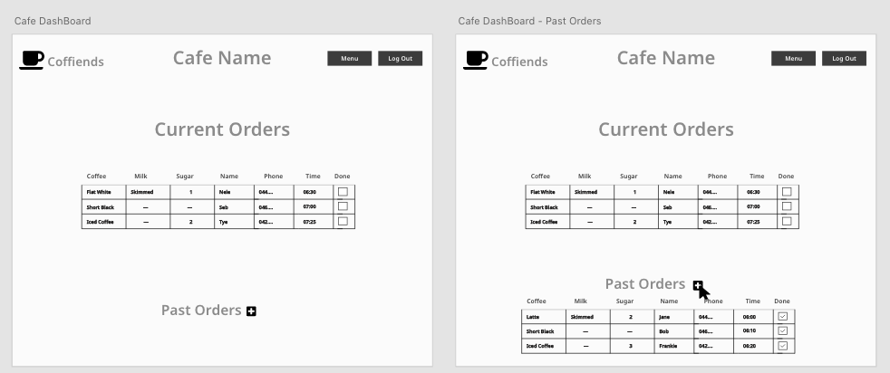

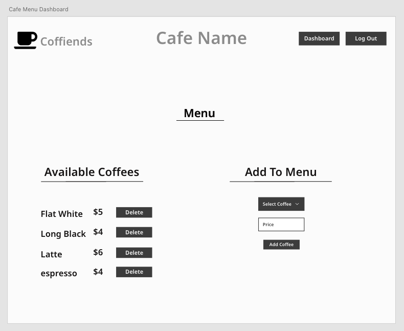

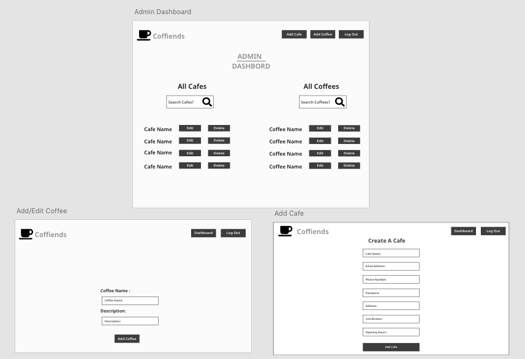

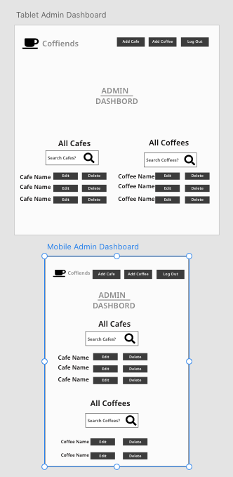

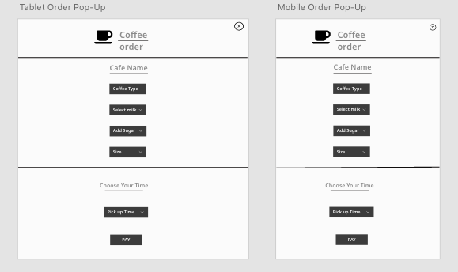

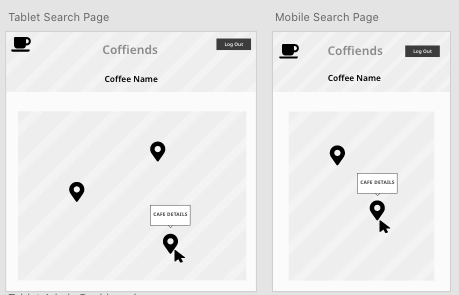

---

## ERD

- Cafe must have one and only one user (cafe belongs to a user)
- User must have one and only one cafe (if user has more than one cafe. they need separate log ins because the devices would be located in cafes)
- Order must have one coffee (for now only one coffee can be ordered and no order can be created without a coffee)
- Order must have one caffe (user must order a cafe to order a coffee)
- A coffee can belong to zero to many orders
- A cafe can have zero to many orders
