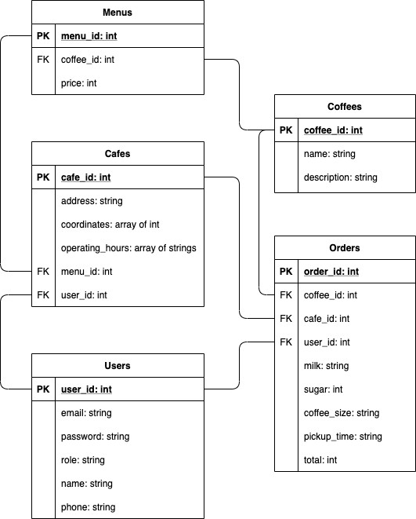

# Coder Academy - T3A2-A - Full Stack App (Part A)

## ERD

- Cafe must have one and only one user (cafe belongs to a user)
- User must have one and only one cafe (if user has more than one cafe. they need separate log ins because the devices would be located in cafes)
- Order must have one coffee (for now only one coffee can be ordered and no order can be created without a coffee)
- Order must have one caffe (user must order a cafe to order a coffee)
- A coffee can belong to zero to many orders
- A cafe can have zero to many orders
